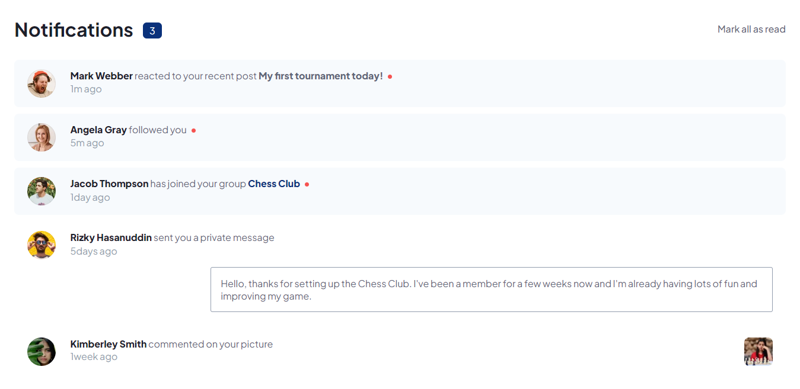

# Frontend Mentor - Notifications page solution

This is a solution to the [Notifications page challenge on Frontend Mentor](https://www.frontendmentor.io/challenges/notifications-page-DqK5QAmKbC).

## Table of contents

- [Frontend Mentor - Notifications page solution](#frontend-mentor---notifications-page-solution)
  - [Table of contents](#table-of-contents)
  - [Overview](#overview)
    - [Screenshot](#screenshot)
    - [The challenge](#the-challenge)
    - [Links](#links)
  - [My process](#my-process)
    - [Built with](#built-with)
  - [Author](#author)

## Overview

### Screenshot

### The challenge

Users should be able to:

- Distinguish between "unread" and "read" notifications
- Select "Mark all as read" to toggle the visual state of the unread notifications and set the number of unread messages to zero
- View the optimal layout for the interface depending on their device's screen size
- See hover and focus states for all interactive elements on the page

### Links

- Solution URL: [My frontend mentor Solution](https://www.frontendmentor.io/solutions/notifications-page-eZodUdJ-zH)
- Live Site URL: [Notifications page - Fanantenana Emmanuel](https://manu3609.github.io/Notifications-page/)

## My process

### Built with

- Semantic HTML5 markup
- CSS custom properties
- Flexbox

## Author

- Github - [Fanantenana Emmanuel](https://github.com/Manu3609/)
- Frontend Mentor - [@Manu3609](https://www.frontendmentor.io/profile/Manu3609)
- Instagram - [@manustxrk](https://www.instagram.com/manustxrk/)
